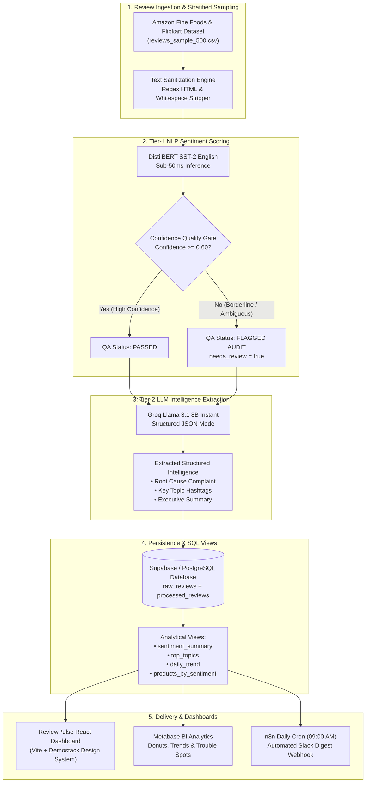

# ⚡ ReviewPulse AI — Real-Time Customer Review & Insight Pipeline

[](https://vitejs.dev/)
[](https://react.dev/)
[](https://huggingface.co/distilbert-base-uncased-finetuned-sst-2-english)
[](https://groq.com/)
[](https://supabase.com/)
[](https://n8n.io/)
[](LICENSE)

> An end-to-end, production-grade NLP intelligence pipeline and modern executive dashboard that ingests raw customer reviews across Amazon Fine Foods & Flipkart, classifies sentiment at sub-50ms speeds, isolates operational root-cause complaints via Groq Llama 3.1, enforces confidence safety gates, and powers live analytical views, Slack digests, and interactive judge demonstrators.

---

## 📖 Table of Contents
- [🎯 About the Project](#-about-the-project)
- [🏛️ System Architecture](#️-system-architecture)
- [🖥️ ReviewPulse Dashboard Overview](#️-reviewpulse-dashboard-overview)
  - [1. Editorial Hero & "Put This ➔ Get That" Studio](#1-editorial-hero--put-this--get-that-studio)
  - [2. Review Stream & Audit Explorer](#2-review-stream--audit-explorer)
  - [3. Executive Analytics Hub](#3-executive-analytics-hub)
  - [4. Confidence QA Gate (< 0.60)](#4-confidence-qa-gate--060)
  - [5. Live Sandbox Playground](#5-live-sandbox-playground)
  - [6. SQL Views & Pipeline Architecture](#6-sql-views--pipeline-architecture)
- [📁 Repository Structure](#-repository-structure)
- [🚀 Quick Start & Running Locally](#-quick-start--running-locally)
  - [Option 1: Launch the Web Dashboard](#option-1-launch-the-web-dashboard)
  - [Option 2: Run the Standalone Python Pipeline](#option-2-run-the-standalone-python-pipeline)
  - [Option 3: Run Orchestrated n8n Workflows](#option-3-run-orchestrated-n8n-workflows)
- [🛠️ Database Schema & Analytical Views](#️-database-schema--analytical-views)
- [💡 Key Engineering & Architectural Highlights](#-key-engineering--architectural-highlights)

---

## 🎯 About The Project

E-commerce brands routinely receive thousands of unstructured reviews daily. Traditional triage workflows either rely on slow manual inspection or brute-force LLM prompts that introduce prohibitive latency (2–5 seconds) and high token costs.

**ReviewPulse AI solves this with a two-tier hybrid NLP pipeline paired with an executive web dashboard**:

1. **Tier 1 — Sub-50ms Sentiment Classification**: A lightweight, fine-tuned **DistilBERT SST-2** model scores raw sentiment and confidence in single-digit milliseconds for fractions of a cent.
2. **Tier 2 — High-Value Root-Cause Diagnosis**: **Groq-accelerated Llama 3.1 8B** is selectively triggered strictly for high-value structured intelligence—extracting root-cause operational complaints, key hashtags, and concise executive summaries.
3. **Quality Assurance Safety Gate**: An automated threshold gate flags borderline reviews (`confidence < 0.60`) for human auditor verification, eliminating silent model drift.
4. **Demostack Production Dashboard**: Built with a luminous light theme, modern typography (**Plus Jakarta Sans**, **Newsreader Italic Serif**, **Inter**, **JetBrains Mono**), floating collapsible sidebar, `⌘K` global search, and a live **"Put This ➔ Get That"** demonstrator studio for live evaluation.

---

## 🏛️ System Architecture



---

## 🖥️ ReviewPulse Dashboard Overview

The web dashboard ([`dashboard/`](file:///e:/Amazon_Food_reviews/dashboard)) is crafted with an executive light theme and custom typography inspired by the **Demostack design system**.

### 1. Editorial Hero & "Put This ➔ Get That" Studio
- **Editorial Typography**: Watermelon-style headline pairing geometric sans-serif with an elegant **Newsreader** blue italic serif (*"Transforming Customer Voice Into Real-Time Actionable Intelligence"*).
- **3D Ambient Flowing Backdrop**: Curated translucent glass ribbons with golden amber drops matching executive aesthetics.
- **Interactive Demonstrator Studio Card**:
  - **Clickable Presets**: Instantly run sample reviews:
    - `🚨 Package Leak` (1-Star olive oil packaging disaster).
    - `⚠️ Ambiguous (< 0.60)` (3-Star coffee review triggering the QA audit gate).
    - `⭐ 5-Star Roast` (5-Star snack mix praise).
  - **Live Pipeline Execution**: Direct browser-to-engine or Groq LLM inference with live sub-50ms latency counter (`Avg ~42ms`).
  - **Typography Hierarchy**: Field labels and scores in **JetBrains Mono**, review body in **Inter**, and extracted root cause in **Newsreader Italic**.

### 2. Review Stream & Audit Explorer
- **Capsule Filter Tabs**: Filter reviews across `All`, `Flagged (<0.60)`, `Complaints`, `Positive`, and `Negative`.
- **Search & Brand Filtering**: Real-time filtering across brands (*Organic Valley*, *Blue Tokai*, *Artisan Blends*) and star ratings (1 to 5 stars).
- **Dual Display Modes**: Toggle between interactive **Grid Cards** and a dense **Executive List Table**.
- **One-Click Actions**: Ingest new reviews, toggle human audit flags, and export filtered datasets directly to CSV.

### 3. Executive Analytics Hub
- **KPI Telemetry Cards**: Total Ingested Reviews, Positive Ratio, Negative Complaint Rate, and Flagged QA Audit count.
- **Sentiment Ratio Visualization**: Donut breakdown displaying positive vs. negative distributions.
- **Complaint Pareto Ranking**: Frequency distribution of root causes (*packaging*, *leakage*, *stale*, *delivery delay*).
- **Product Problem Leaderboard**: Highlights SKUs with highest negative ratios for rapid operations triage.

### 4. Confidence QA Gate (< 0.60)
- Demonstrates how the pipeline automatically prevents hallucinated or low-confidence classifications from skewing business analytics.
- Reviews with confidence `< 0.60` receive an amber `⚠️ FLAGGED AUDIT` badge and are routed to a dedicated human review queue.

### 5. Live Sandbox Playground
- An interactive workbench allowing engineers and product managers to test custom review text, adjust star ratings, tweak confidence thresholds, and evaluate Groq Llama 3.1 prompts in real time.

### 6. SQL Views & Pipeline Architecture
- View and copy pre-compiled PostgreSQL schema definitions, DDL scripts, and view queries directly into Supabase, Metabase, or external data warehouses.

---

## 📁 Repository Structure

```
Amazon_Food_reviews/
├── dashboard/                      # Modern React + Vite Executive Web Dashboard
│   ├── src/
│   │   ├── components/
│   │   │   ├── Hero.jsx            # Editorial Hero & "Put This -> Get That" Studio
│   │   │   ├── KpiMetrics.jsx      # KPI Telemetry Cards & Metrics
│   │   │   ├── demostack/
│   │   │   │   ├── DemostackSidebar.jsx  # Floating collapsible navigation sidebar
│   │   │   │   ├── DemostackTopbar.jsx   # Topbar with ⌘K search & live actions
│   │   │   │   ├── DemostackCardView.jsx # Review Stream (Grid/Table views & CSV export)
│   │   │   │   ├── ArchitectureView.jsx  # SQL Views & Pipeline Architecture viewer
│   │   │   │   └── DemostackIcons.jsx    # SVG icons matching Demostack registry
│   │   │   └── ...
│   │   ├── utils/
│   │   │   └── pipelineEngine.js   # Client-side NLP & Groq Llama 3.1 pipeline runner
│   │   ├── assets/                 # Ambient background images & static assets
│   │   ├── index.css               # Full Demostack light design system & typography tokens
│   │   └── App.jsx                 # Main application state & tab coordinator
│   ├── index.html                  # Google Fonts: Plus Jakarta Sans, Newsreader, Inter, JetBrains Mono
│   └── package.json
├── reviews_sample_500.csv          # Stratified balanced sample (100 reviews per rating 1-5, 500 total)
├── reviews_test_10.csv             # 10-row test dataset (2 per rating) for rapid dry-runs
├── create_sample_dataset.py        # Stratified sampling script extracting balanced sets from raw data
├── schema.sql                      # Supabase / PostgreSQL DDL creating tables and 4 analytical views
├── n8n_review_pipeline.json        # Import-ready n8n workflow (HF DistilBERT + Groq Llama 3.1 + Postgres)
├── n8n_slack_digest.json           # Import-ready n8n workflow for scheduled daily Slack digests
├── run_pipeline_local.py           # Standalone Python local pipeline tester with dry-run support
├── .env.example                    # Environment variable template
└── README.md                       # Comprehensive project documentation
```

---

## 🚀 Quick Start & Running Locally

### Option 1: Launch the Web Dashboard

1. **Navigate to the dashboard directory**:
   ```bash
   cd dashboard
   ```

2. **Install dependencies**:
   ```bash
   npm install
   ```

3. **Configure environment variables**:
   Create a `dashboard/.env` file:
   ```env
   VITE_GROQ_API_KEY=your_groq_api_key_here
   ```
   *(Get your free Groq API key from [console.groq.com](https://console.groq.com). If left empty, the dashboard seamlessly uses local deterministic NLP simulation for zero-configuration testing.)*

4. **Start the development server**:
   ```bash
   npm run dev
   ```
   Open **`http://localhost:5173`** in your browser.

---

### Option 2: Run the Standalone Python Pipeline

Test the NLP classification and Groq LLM extraction directly from your terminal:

1. **Set up virtual environment & install requirements**:
   ```bash
   python -m venv venv
   source venv/bin/activate  # On Windows: venv\Scripts\activate
   pip install requests python-dotenv
   ```

2. **Run a dry-run test (no external API calls required)**:
   ```bash
   python run_pipeline_local.py --dry-run
   ```

3. **Run live validation with Groq & Hugging Face**:
   Configure `.env` with your API keys, then execute:
   ```bash
   python run_pipeline_local.py --input reviews_test_10.csv
   ```

---

### Option 3: Run Orchestrated n8n Workflows

1. **Start n8n** via Docker or NPX:
   ```bash
   npx n8n
   # or: docker run -it --rm -p 5678:5678 n8nio/n8n
   ```
2. Open `http://localhost:5678`.
3. In the top-right menu, select **Import from File** and import:
   - [`n8n_review_pipeline.json`](file:///e:/Amazon_Food_reviews/n8n_review_pipeline.json) — Full batch ingestion, DistilBERT classification, QA confidence branching, and Groq LLM extraction.
   - [`n8n_slack_digest.json`](file:///e:/Amazon_Food_reviews/n8n_slack_digest.json) — Daily 9:00 AM automated executive Slack digest query.
4. Add your **Postgres (Supabase)**, **Hugging Face**, and **Groq** credentials in n8n and click **Test step**.

---

## 🛠️ Database Schema & Analytical Views

Execute [`schema.sql`](file:///e:/Amazon_Food_reviews/schema.sql) in your Supabase SQL Editor. The schema provisions:

- `raw_reviews`: Immutable staging table capturing raw ingested customer reviews.
- `processed_reviews`: Sanitized text, sentiment label (`POSITIVE`/`NEGATIVE`), confidence score, `needs_review` boolean, Llama 3.1 extracted complaint, topic hashtags, and executive summary.
- **4 Analytical SQL Views**:
  1. `sentiment_summary`: Aggregates total reviews, positive/negative counts, ratios, and flagged QA review totals.
  2. `top_topics`: Unnests topic arrays to compute frequency counts and negative complaint mentions per topic.
  3. `daily_trend`: Time-series sentiment distribution aggregated by ingestion date.
  4. `products_by_sentiment`: SKU-level sentiment breakdown to isolate problematic product batches.

---

## 💡 Key Engineering & Architectural Highlights

1. **Stratified Sentiment Sampling**:
   Raw e-commerce datasets are typically skewed with >65% 5-star praise. Our dataset sampler (`create_sample_dataset.py`) extracts an exact balanced distribution of 100 reviews per star rating (1–5), ensuring operational defects and edge cases are represented.

2. **Cost-Optimized Two-Tier Architecture**:
   Executing an LLM for sentiment classification across 100,000 reviews costs tens of dollars and creates severe API latency. ReviewPulse AI delegates initial classification to millisecond-fast **DistilBERT**, reserving the **Llama 3.1 LLM** exclusively for complex complaint isolation and summarization.

3. **Confidence-Aware Safety Gating**:
   Reviews with confidence scores below `0.60` are automatically tagged with `needs_review = true`, providing enterprise governance and human-in-the-loop auditability.

4. **Defensive Parsing & Fallbacks**:
   Groq API calls utilize strict JSON schema enforcement with local regex fallbacks, preventing malformed LLM outputs from breaking batch pipelines.

---

## 📄 License

This project is licensed under the [MIT License](LICENSE).
