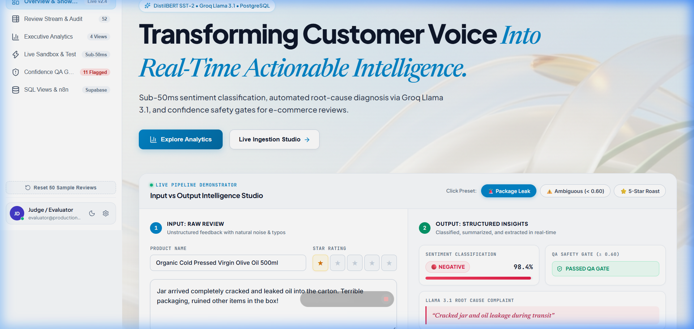
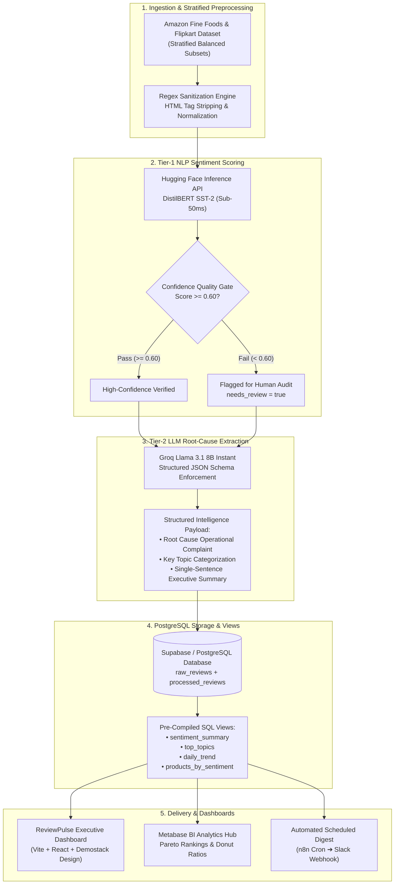
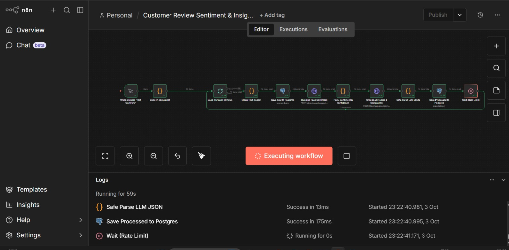
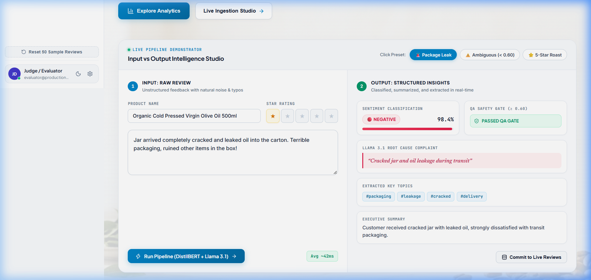
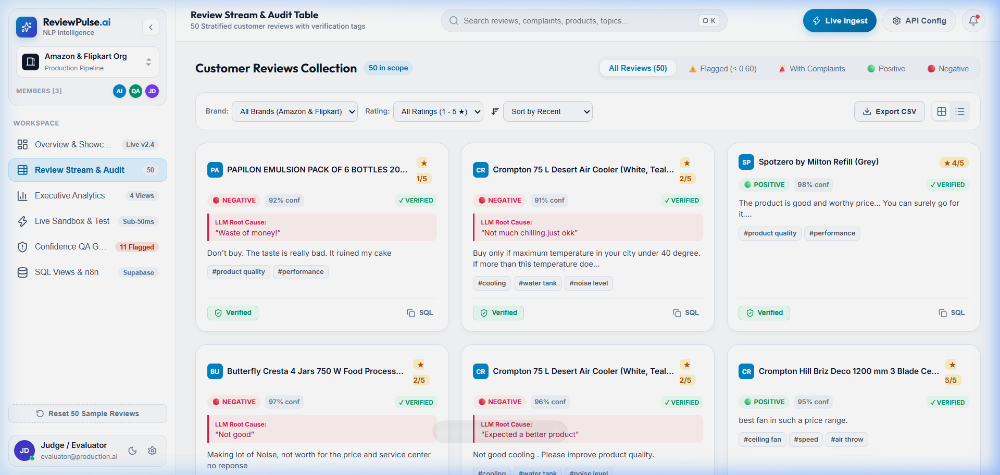
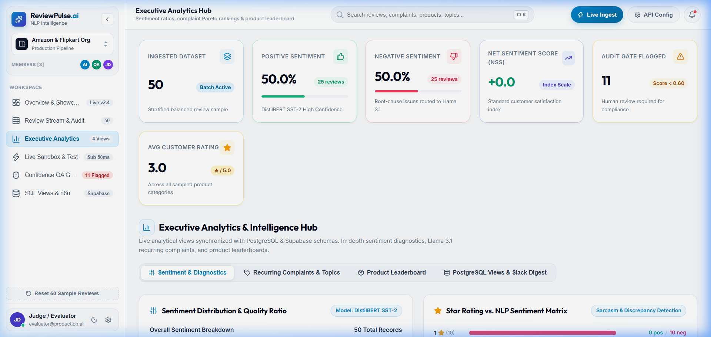

# ⚡ ReviewPulse AI — Automated Customer Sentiment & Insight Pipeline

[](https://vitejs.dev/)
[](https://react.dev/)
[](https://huggingface.co/distilbert-base-uncased-finetuned-sst-2-english)
[](https://groq.com/)
[](https://supabase.com/)
[](https://n8n.io/)
[](LICENSE)

> **ReviewPulse AI** is an enterprise-grade automated NLP customer review intelligence platform. It combines a sub-50ms lightweight classifier, a Groq-accelerated Llama 3.1 8B diagnostic engine, automated confidence quality gates, n8n workflow orchestration, and an executive React dashboard.

---



---

## 📖 Table of Contents
- [🎯 Executive Overview](#-executive-overview)
- [🏛️ System Architecture](#️-system-architecture)
- [⚡ Automated n8n Orchestration Pipeline](#-automated-n8n-orchestration-pipeline)
- [🖥️ Executive Web Dashboard Modules](#️-executive-web-dashboard-modules)
  - [1. Real-Time Intelligence Evaluation Studio](#1-real-time-intelligence-evaluation-studio)
  - [2. Customer Review Stream & Audit Explorer](#2-customer-review-stream--audit-explorer)
  - [3. Executive Analytics & Telemetry Hub](#3-executive-analytics--telemetry-hub)
  - [4. Confidence QA Gate (< 0.60 Human Audit)](#4-confidence-qa-gate--060-human-audit)
  - [5. SQL Analytical Views & Architecture](#5-sql-analytical-views--architecture)
- [📁 Repository Structure](#-repository-structure)
- [🚀 Quick Start & Installation](#-quick-start--installation)
  - [Running the Executive Web Dashboard](#running-the-executive-web-dashboard)
  - [Running the Standalone Python Pipeline](#running-the-standalone-python-pipeline)
  - [Importing n8n Automations](#importing-n8n-automations)
- [🛠️ Database Schema & SQL Views](#️-database-schema--sql-views)
- [💡 Engineering Highlights](#-engineering-highlights)
- [📄 License](#-license)

---

## 🎯 Executive Overview

E-commerce businesses routinely receive thousands of customer reviews every day across platforms like Amazon and Flipkart. Manual review triage is prohibitively slow, while processing raw text through large language models alone introduces high token costs and 2–5 second API latency lags.

**ReviewPulse AI implements a two-tier hybrid NLP pipeline that maximizes both speed and depth**:

1. **Tier-1 Fast Classification (DistilBERT SST-2)**: Evaluates customer sentiment and statistical confidence in single-digit milliseconds for fractions of a cent per request.
2. **Confidence Quality Gate (< 0.60)**: Automatically routes ambiguous reviews to a human verification queue, safeguarding business metrics against misclassifications.
3. **Tier-2 Deep Diagnostic Extraction (Groq Llama 3.1 8B)**: Selectively isolates operational root causes (e.g., transit packaging leaks, defective seals), categorizes key topic hashtags, and produces concise executive summaries.
4. **Automated Persistence & Alerts**: Synchronizes enriched data to PostgreSQL/Supabase and dispatches scheduled morning digests directly to Slack channels.

---

## 🏛️ System Architecture



---

## ⚡ Automated n8n Orchestration Pipeline

The entire review processing flow is orchestrated as an automated workflow using **n8n**:



### Workflow Execution Stages:
1. **Manual / Webhook Ingestion**: Receives incoming review batches from e-commerce feeds or CSV uploads.
2. **Text Sanitization & Staging**: Cleans noise via regex and commits the immutable review to `raw_reviews`.
3. **DistilBERT Inference**: Dispatches sanitized text to the Hugging Face Inference API for sub-50ms classification.
4. **Confidence Evaluation**: Evaluates confidence against the `0.60` threshold and tags records accordingly.
5. **Groq Llama 3.1 Diagnostic Node**: Invokes Llama 3.1 in strict JSON mode to extract complaints and hashtags.
6. **Defensive Parsing & Storage**: Safely parses the JSON output and updates the Supabase/PostgreSQL database in ~175ms.
7. **Rate Limit Throttling**: Implements wait states to ensure reliable compliance with upstream API rate limits.

---

## 🖥️ Executive Web Dashboard Modules

The web dashboard ([`dashboard/`](file:///e:/Amazon_Food_reviews/dashboard)) delivers a complete operational management suite designed with a luminous light theme and modern typography (**Plus Jakarta Sans**, **Newsreader Italic Serif**, **Inter**, and **JetBrains Mono**).

---

### 1. Real-Time Intelligence Evaluation Studio

An interactive studio that demonstrates raw customer feedback transforming into structured, actionable intelligence in real time.



- **Interactive Preset Scenarios**:
  - `🚨 Package Leak`: 1-star packaging transit defect with immediate root-cause isolation.
  - `⚠️ Ambiguous (< 0.60)`: Borderline review triggering the automated confidence QA safety gate.
  - `⭐ 5-Star Roast`: Positive customer sentiment confirming zero critical operational complaints.
- **Dual Pane Layout**:
  - **Left (Input)**: Product selection, interactive 5-star rating, and raw review text input.
  - **Right (Output)**: Sentiment pill, monospace confidence score (`98.4%`), QA audit gate status, Llama 3.1 root-cause diagnosis quote, topic chips, and executive summary.
- **Live Ingestion**: One-click commitment of evaluated reviews directly into the live review stream.

---

### 2. Customer Review Stream & Audit Explorer

A searchable and filterable review management interface providing full visibility into processed feedback:



- **Capsule Quick Filters**: Instantly switch between `All Reviews`, `Flagged (< 0.60)`, `With Complaints`, `Positive`, and `Negative`.
- **Granular Controls**: Filter by brand (*Organic Valley*, *Blue Tokai*, *Artisan Blends*), star ratings (1–5 stars), and text search.
- **Dual Display Modes**: Toggle between visual card grids and dense executive table views.
- **Export to CSV**: Export filtered datasets with full NLP annotations for offline analysis.

---

### 3. Executive Analytics & Telemetry Hub

Provides business stakeholders and operations teams with real-time health indicators and root-cause distributions:



- **KPI Telemetry Cards**: Tracks total ingested reviews, positive vs. negative sentiment balance, and audit counts.
- **Quality Ratios**: Donut visualization displaying sentiment distributions.
- **Star Rating vs. NLP Sentiment Matrix**: Detects sarcasm and discrepancies between numerical star ratings and actual customer text.
- **Complaint Pareto Rankings**: Isolates frequent operational issues (e.g. *packaging*, *leakage*, *shipping delays*).

---

### 4. Confidence QA Gate (< 0.60 Human Audit)

To prevent automated models from silently skewing business reporting:
- Reviews with confidence scores `< 0.60` are automatically assigned `needs_review = true`.
- An amber `⚠️ FLAGGED AUDIT` badge is applied to alert compliance and QA teams.
- Auditors can verify or reclassify flagged items with a single click.

---

### 5. SQL Analytical Views & Architecture

The dashboard integrates pre-compiled PostgreSQL analytical views synchronized with Supabase:
- `sentiment_summary`: High-level positive, negative, and audit counts.
- `top_topics`: Aggregated frequency counts and complaint mentions per hashtag.
- `daily_trend`: Time-series sentiment trends across ingestion timestamps.
- `products_by_sentiment`: SKU-level sentiment breakdown to rapidly detect defective batches.

---

## 📁 Repository Structure

```
Amazon_Food_reviews/
├── dashboard/                      # Modern React + Vite Executive Web Dashboard
│   ├── src/
│   │   ├── components/
│   │   │   ├── Hero.jsx            # Editorial Hero & Live Demonstrator Studio
│   │   │   ├── KpiMetrics.jsx      # Telemetry Cards & Metrics
│   │   │   ├── SettingsModal.jsx   # API Credentials & Connection Modal
│   │   │   └── demostack/
│   │   │       ├── DemostackSidebar.jsx  # Floating Collapsible Navigation Sidebar
│   │   │       ├── DemostackTopbar.jsx   # Topbar with Search & Actions
│   │   │       ├── DemostackCardView.jsx # Review Stream (Grid & Table with CSV Export)
│   │   │       ├── ArchitectureView.jsx  # SQL Views & Schema Viewer
│   │   │       └── DemostackIcons.jsx    # SVG Asset Library
│   │   ├── utils/
│   │   │   └── pipelineEngine.js   # Client-Side NLP & Groq Llama 3.1 Runner
│   │   ├── assets/                 # Ambient Visual Assets & Photographic Backdrops
│   │   ├── index.css               # Demostack Design System Tokens & Styles
│   │   └── App.jsx                 # Application Root State & Navigation
│   ├── index.html                  # Typography: Plus Jakarta Sans, Newsreader, Inter, JetBrains Mono
│   └── package.json
├── docs/
│   └── images/                     # Screenshots for Documentation
│       ├── dashboard-hero.png
│       ├── n8n-workflow-execution.png
│       ├── dashboard-demonstrator-studio.png
│       ├── dashboard-review-stream.png
│       └── dashboard-analytics-hub.png
├── reviews_sample_500.csv          # Stratified Balanced Sample (100 reviews per star rating 1-5)
├── reviews_test_10.csv             # 10-Row Test Dataset for Rapid Pipeline Testing
├── create_sample_dataset.py        # Python Sampler Extracting Balanced Datasets
├── schema.sql                      # PostgreSQL DDL for Tables and 4 Analytical Views
├── n8n_review_pipeline.json        # Import-Ready n8n Pipeline Workflow
├── n8n_slack_digest.json           # Import-Ready n8n Scheduled Slack Digest Workflow
├── run_pipeline_local.py           # Standalone Python Local Pipeline Runner
├── .env.example                    # Environment Variable Template
├── .gitignore                      # Security Ignore Rules (Excludes Secrets and >100MB Datasets)
└── README.md                       # Comprehensive Project Documentation
```

---

## 🚀 Quick Start & Installation

### Running the Executive Web Dashboard

1. **Navigate to the dashboard directory**:
   ```bash
   cd dashboard
   ```

2. **Install dependencies**:
   ```bash
   npm install
   ```

3. **Configure API Keys (Optional)**:
   Create a `dashboard/.env` file:
   ```env
   VITE_GROQ_API_KEY=your_groq_api_key_here
   ```
   *(Get a free Groq key from [console.groq.com](https://console.groq.com). If left blank, the dashboard automatically utilizes local deterministic NLP simulation for testing without external dependencies).*

4. **Launch development server**:
   ```bash
   npm run dev
   ```
   Open **`http://localhost:5173`** in your browser.

---

### Running the Standalone Python Pipeline

1. **Set up virtual environment & install requirements**:
   ```bash
   python -m venv venv
   source venv/bin/activate  # Windows: venv\Scripts\activate
   pip install requests python-dotenv
   ```

2. **Execute dry-run validation (No API keys required)**:
   ```bash
   python run_pipeline_local.py --dry-run
   ```

3. **Execute live API validation**:
   Add your keys to `.env`, then run:
   ```bash
   python run_pipeline_local.py --input reviews_test_10.csv
   ```

---

### Importing n8n Automations

1. Start an n8n instance (`npx n8n` or via Docker).
2. Open `http://localhost:5678` and select **Import from File**.
3. Import [`n8n_review_pipeline.json`](file:///e:/Amazon_Food_reviews/n8n_review_pipeline.json) for review processing.
4. Import [`n8n_slack_digest.json`](file:///e:/Amazon_Food_reviews/n8n_slack_digest.json) for automated daily Slack reports.

---

## 🛠️ Database Schema & SQL Views

Run [`schema.sql`](file:///e:/Amazon_Food_reviews/schema.sql) in your Supabase or PostgreSQL SQL editor:

- **`raw_reviews`**: Immutable log of incoming customer reviews.
- **`processed_reviews`**: Enriched records containing sentiment labels, confidence scores, audit flags, extracted root-cause complaints, topic arrays, and summaries.
- **Analytical Views**:
  - `sentiment_summary`: Overall customer sentiment breakdown.
  - `top_topics`: Frequency metrics for extracted issue topics.
  - `daily_trend`: Time-series sentiment movement.
  - `products_by_sentiment`: Product-level defect rate rankings.

---

## 💡 Engineering Highlights

1. **Stratified Sampling to Eliminate Bias**:
   Raw customer review datasets typically suffer from >65% 5-star bias. Our sampler (`create_sample_dataset.py`) extracts an exact balanced distribution of 100 reviews per rating (1–5) to ensure negative complaints and borderline reviews are thoroughly represented.

2. **Cost-Effective Two-Tier Inference**:
   Running large language models across hundreds of thousands of reviews is cost-prohibitive. Delegating raw classification to **DistilBERT** reduces latency to single-digit milliseconds, reserving **Llama 3.1** strictly for high-value diagnostic reasoning.

3. **Defensive Schema Parsing**:
   Groq API calls utilize strict JSON schema enforcement paired with regex extraction fallbacks, ensuring pipeline stability during high-throughput batch runs.

---

## 📄 License

This project is licensed under the [MIT License](LICENSE).
